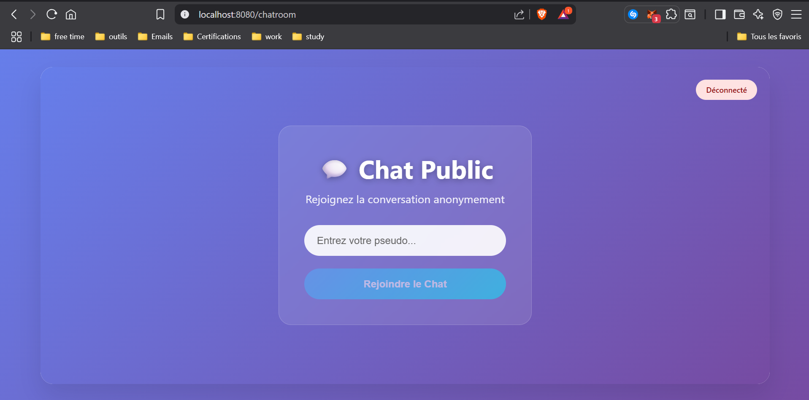
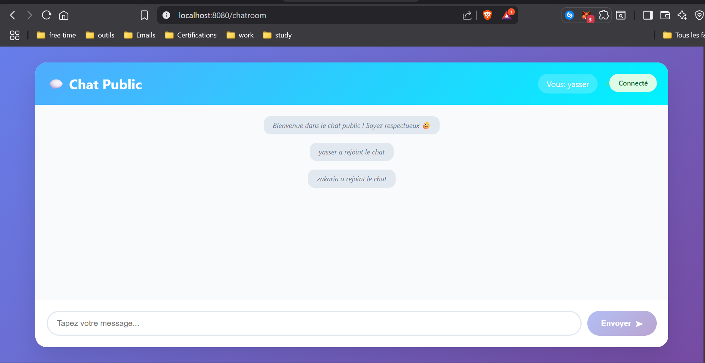
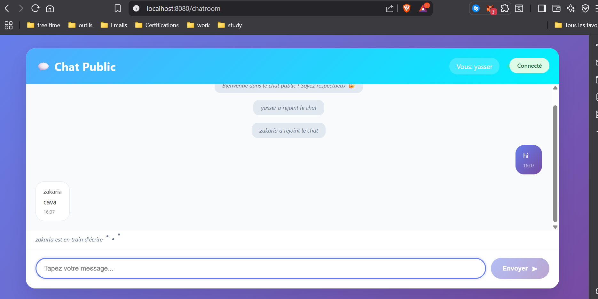

# 💬 Spring Boot ChatRoom

Ce projet est une application de **chat public anonyme en temps réel**, développée avec **Spring Boot**, **WebSocket (STOMP)**, **Thymeleaf** et **MongoDB**. Il permet aux utilisateurs de rejoindre le chat anonymement, de voir les messages en temps réel, de visualiser les utilisateurs en ligne, et de voir les indicateurs de frappe ("typing...").

## 🚀 Fonctionnalités

- Connexion anonyme avec pseudo
- Messagerie instantanée avec WebSocket + STOMP
- Indicateur de frappe en temps réel
- Comptage des utilisateurs en ligne
- Historique des messages sauvegardé dans MongoDB
- Interface responsive avec Thymeleaf et CSS

---

## 🛠️ Technologies utilisées

- Java 21
- Spring Boot 3.5.x
- Spring WebSocket + STOMP
- Spring Data MongoDB
- Thymeleaf
- MongoDB (local)
- SockJS / STOMP.js (frontend)
- HTML / CSS

---

## 📁 Structure du projet

chatroom/
├── src/
│ ├── main/
│ │ ├── java/com/chatroom/
│ │ │ ├── ChatroomApplication.java
│ │ │ ├── controller/ChatController.java
│ │ │ ├── model/Message.java
│ │ │ ├── repository/MessageRepository.java
│ │ │ ├── payload/TypingPayload.java
│ │ │ └── service/OnlineUserService.java
│ │ └── resources/
│ │ ├── templates/chatroom.html
│ │ ├── static/css/chatroom.css
│ │ └── application.properties
└── pom.xml

## ⚙️ Configuration MongoDB

Assure-toi d'avoir un serveur MongoDB en local (par défaut sur `localhost:27017`).

Le fichier `application.properties` :

```properties
spring.data.mongodb.database=chatroomdb
spring.data.mongodb.host=localhost
spring.data.mongodb.port=27017
spring.thymeleaf.prefix=classpath:/templates/
spring.thymeleaf.suffix=.html

▶️ Lancer l'application 

1. Cloner le projet : 
git clone https://github.com/ton-utilisateur/chatroom.git
cd chatroom

2. Lancer MongoDB (en local) : 
Assure-toi que MongoDB tourne sur localhost:27017.

3. Lancer l'application : 
mvn spring-boot:run 

4. Accéder à l'interface
Ouvre ton navigateur sur http://localhost:8080/chatroom

✨ Démo visuelle 




👨‍💻 Auteur
Projet réalisé par Mohammed Yasser Rachih – Étudiant en Master Big Data & Data Science.